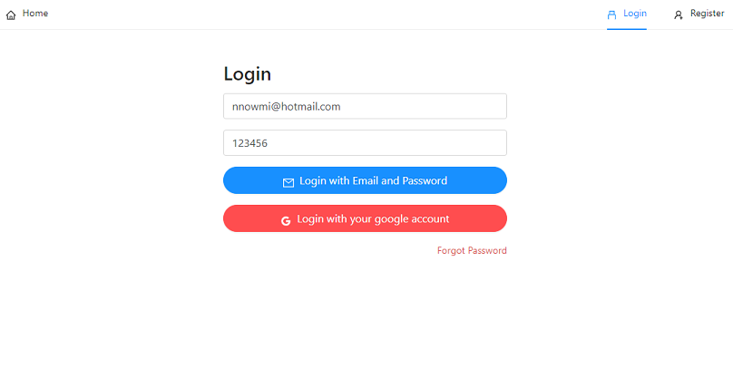

# Roop Kotha Boson

Roop kotha Bosson Its a traditional Indian fashion house, where you can find all kind of women, men and kid’s cloths. Its offering you lots of choices and prices ranges according to your choices. you can see the new arrival and all products in pre order

## Table of content
- [Descriptin](#Descrption)
- [Installation Frontend](#Installation_FrontEnd)
- [Installation Backend](#Installation_BackEnd)
- [Screenshot](#Screenshot)
- [API Integration](#API)
- [How to Run](#Rum)
- [Contributing](#Contributing)

## Descrption
```md
WHEN I click on register button
THEN I am diverted to a register page where I have option to register with my email account.
WHEN I register with my email account
THEN an email is sent to me to verify my credentials
WHEN I click the link send throught email
THEN I am diverted to a register conferm page where I have option to put my password and divert to home page.
WHEN I click on login button
THEN I am diverted to a login page where I have option to login and forgor password as well
WHEN I click on forgot password link
THEN an email is sent to me to reset my password and send me to home page
```

## Installation_Frontend
```md
 ### For frontend (client) 
run cd client >>

// For creating REACT APP
npx create-react-app roopkotha

npm  install react-router-dom
npm install redux
npm install react-redux
npm install redux-devtools-extension
use the same package.json and run npm install

//For Design 
npm install antd
npm install @ant-design/icons


//For Authentication 
npm install firebase

// For message
npm install react-toastify

Import:
For Bootstrap material design : https://mdbootstrap.com/
For ant design : https://ant.design/

```
## Installation_Backend
```md

```
## Screenshot
[]
## Run
On Localhost:
For client side: npm start
For server side: 

## Contributing


=======

# Roop Kotha Boson

Roop kotha Bosson Its a traditional Indian fashion house, where you can find all kind of women, men and kid’s cloths. Its offering you lots of choices and prices ranges according to your choices. you can see the new arrival and all products in pre order

## Table of content
- [Descriptin](#Descrption)
- [Installation Frontend](#Installation_FrontEnd)
- [Installation Backend](#Installation_BackEnd)
- [Screenshot](#Screenshot)
- [API Integration](#API)
- [How to Run](#Rum)
- [Contributing](#Contributing)

## Descrption
```md
WHEN I click on register button
THEN I am diverted to a register page where I have option to register with my email account.
WHEN I register with my email account
THEN an email is sent to me to verify my credentials
WHEN I click the link send throught email
THEN I am diverted to a register conferm page where I have option to put my password and divert to home page.
WHEN I click on login button
THEN I am diverted to a login page where I have option to login and forgor password as well
WHEN I click on forgot password link
THEN an email is sent to me to reset my password and send me to home page
```

## Installation_Frontend
```md
 ### For frontend (client) 
run cd client >>

// For creating REACT APP
npx create-react-app roopkotha

npm  install react-router-dom
npm install redux
npm install react-redux
npm install redux-devtools-extension
use the same package.json and run npm install

//For Design 
npm install antd
npm install @ant-design/icons


//For Authentication 
npm install firebase

// For message
npm install react-toastify

Import:
For Bootstrap material design : https://mdbootstrap.com/
For ant design : https://ant.design/

```
## Installation_Backend
```md

```
## Screenshot
[]
## Run
On Localhost:
For client side: npm start
For server side: 

## Contributing

Ruma Das


